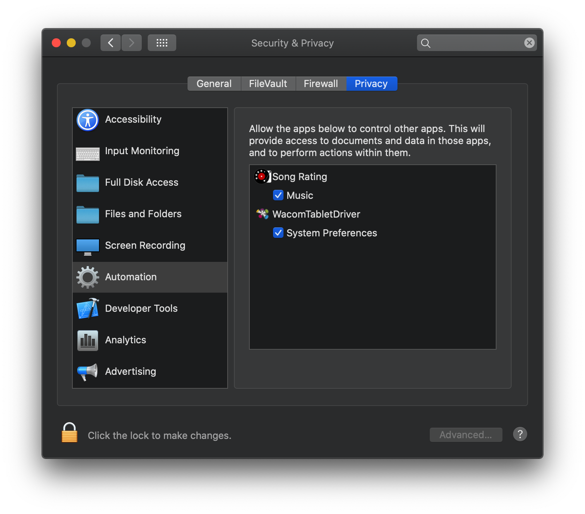

# Song Rating
macOS app for rating music in iTunes/Music.app

## Requirements
- macOS 10.14 +

## Downloads
**Mac App Store:**  

**Build Release:**  
[https://github.com/MainasuK/Song-Rating/releases](https://github.com/MainasuK/Song-Rating/releases)

## FAQ
### How can I check the track rating in iTunes/Music.app?  
Check the checkbox for "Star Ratings" in General preferences. [More info](https://support.apple.com/guide/music/general-preferences-mus4130f48/mac)

### Why the popover player sometimes follows to new screen scenes but sometimes not?
The popover will jump to new scren scene when it get focused. It will stand in the old screen if the current focused window not the popover.

### Why Song Rating not show star rating when iTunes/Music playing?
Please check the Security & Privacy settings and check the checkbox of Song Rating.
